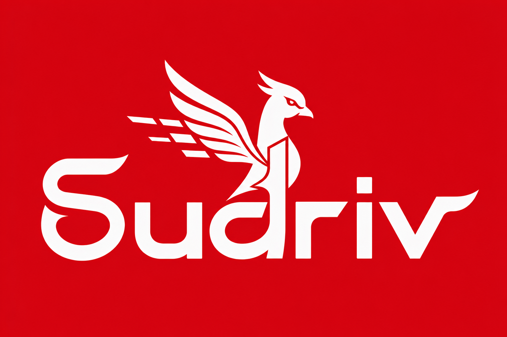

<p align="center">
  
</p>

<h1 align="center">Sudriv</h1>

<p align="center">
  <strong>Real-time AI co-pilot for live television news producers</strong><br />
  <em>Producer speaks → AI updates the running order → Anchor gets a clean cue</em>
</p>

<p align="center">
  <a href="https://nextjs.org/"></a>
  <a href="https://www.typescriptlang.org/"></a>
  <a href="https://livekit.io/"></a>
  <a href="https://python.org/"></a>
  <a href="https://supabase.com/"></a>
  <a href="https://openai.com/"></a>
  <a href="https://sarvam.ai/"></a>
  <a href="https://vercel.com/"></a>
  <a href="https://railway.app/"></a>
  <a href="https://upstash.com/"></a>
</p>

<p align="center">
  <a href="#-voice-ai-pipeline-deep-dive">Voice AI Pipeline</a> ·
  <a href="#-architecture">Architecture</a> ·
  <a href="#-setup-guide-a-to-z">Setup</a> ·
  <a href="#-deployment">Deploy</a> ·
  <a href="#-testing">Testing</a> ·
  <a href="./DEPLOY.md">DEPLOY.md</a> ·
  <a href="./TESTING.md">TESTING.md</a> ·
  <a href="./docs/DECISIONS.md">Decisions</a> ·
  <a href="./knowledge-base/">Knowledge Base</a>
</p>

---

## Table of Contents

1. [Overview](#-overview)
2. [Architecture](#-architecture)
3. [Tech Stack (Detailed)](#-tech-stack-detailed)
4. [Voice AI Pipeline (Deep Dive)](#-voice-ai-pipeline-deep-dive)
5. [Core Features](#-core-features)
6. [Project Structure](#-project-structure)
7. [Setup Guide (A to Z)](#-setup-guide-a-to-z)
8. [Deployment](#-deployment)
9. [How to Use](#-how-to-use)
10. [Testing](#-testing)
11. [Security Notes](#-security-notes)
12. [Future Improvements](#-future-improvements)
13. [Documentation Map](#-documentation-map)
14. [Team & License](#-team--license)

---

## Overview

### What is Sudriv?

**Sudriv** is a **real-time, voice-first AI co-pilot** built for television news **producers** sitting in the Production Control Room (PCR). During breaking news, the producer speaks naturally to the agent. The agent:

1. **Understands** intent via streaming speech-to-text  
2. **Reasons** about the current running order with an LLM  
3. **Calls tools** to analyze impact, propose changes, and apply updates only after confirmation  
4. **Speaks back** via low-latency TTS  
5. **Syncs the UI** — timeline, teleprompter / anchor script, and session state  

**One-line pitch:** Sudriv turns live breaking-news chaos into calm, voice-controlled timeline updates and clean instructions for the anchor.

### The problem (newsroom producer chaos)

In a live newsroom, the producer must juggle:

| Task | Today (without Sudriv) |
|------|------------------------|
| Ingest breaking info | Manual feeds, wires, phones |
| Edit the **running order** (segment timeline) | Spreadsheet / rundown software under time pressure |
| Calculate **cascading impact** (who slips, by how much) | Mental math on live TV |
| Tell the **anchor** what changed | Unstructured IFB talk |
| Keep **teleprompter** in sync | Separate system, laggy, error-prone |

This is fragmented, manual, high-stress, and one mistake is irreversible on air.

### The solution

Sudriv sits **with the producer only** (not the on-air anchor):

```
Breaking news arrives
        │
        ▼
Producer talks to Sudriv (push-to-talk voice)
        │
        ▼
STT → LLM (+ tools) → TTS reply
        │
        ├── Propose change + impact
        ├── Producer confirms by voice
        ├── Running order written to Supabase + Redis
        └── Anchor script / teleprompter text updates in the control UI
```

**Design principles:**

| Principle | Implementation |
|-----------|----------------|
| Voice-first | Hands stay free; push-to-talk mic in the session UI |
| Human-in-the-loop | AI **proposes**; producer **confirms**; no silent mutations |
| Real-time | LiveKit WebRTC + agent worker + poll/refresh on control UI |
| Context-aware | Focus window (NOW + next slots + top news) + tools for full detail |
| Production safety | Confirmation guard, noise-turn filtering, valid instruction types |

---

## Architecture

<p align="center">
  
</p>

### High-level system planes

Sudriv is a **monorepo** with three logical planes:

| Plane | Responsibility | Runtime |
|-------|----------------|---------|
| **Presentation** | Login, dashboard, live control room UI | Next.js on **Vercel** |
| **Voice** | STT → LLM → tools → TTS, barge-in, sessions | Python **LiveKit Agent** on **Railway** |
| **Data** | Auth, persistence, hot cache | **Supabase** + **Upstash Redis** |

**Media** always rides **LiveKit Cloud** (WebRTC SFU). The agent does **not** terminate WebRTC itself for the browser; it joins the same room as a server-side participant.

### End-to-end data & media flow

```
┌─────────────────────────────────────────────────────────────────────────────┐
│                         PRODUCER BROWSER (Vercel)                            │
│  Login (Supabase Auth) → Dashboard → Session Control Room                    │
│  ┌──────────┐ ┌────────────┐ ┌──────────────┐ ┌──────────────────────────┐  │
│  │ Timeline │ │ Anchor     │ │ AI Copilot   │ │ LiveKitRoom + PTT mic    │  │
│  │ Panel    │ │ Script     │ │ Transcript   │ │ RoomAudioRenderer        │  │
│  └────┬─────┘ └─────┬──────┘ └──────┬───────┘ └────────────┬─────────────┘  │
│       │             │               │                      │                │
│       │    GET /api/session/:id/running-order (poll 1.5s)  │ WebRTC audio   │
│       └─────────────┴───────────────┘                      │                │
└───────────────────────────┬────────────────────────────────┼────────────────┘
                            │ HTTPS                          │ WSS / WebRTC
                            ▼                                ▼
                 ┌────────────────────┐            ┌─────────────────────┐
                 │  Next.js API       │            │  LiveKit Cloud SFU  │
                 │  · /api/session    │            │  Room: sudriv-{id}  │
                 │  · /api/livekit/   │            │  producer + agent   │
                 │    token           │            └──────────┬──────────┘
                 └─────────┬──────────┘                       │
                           │                                  │ Agent joins room
                           ▼                                  ▼
                 ┌────────────────────┐            ┌─────────────────────┐
                 │ Supabase Postgres  │◄───────────│ Python Agent        │
                 │ Auth · sessions ·  │  service   │ (Railway)           │
                 │ running_orders ·   │  role      │ LiveKit Agents 1.6  │
                 │ segments · anchor  │            │ Silero VAD          │
                 │ _instructions      │            │ Sarvam STT/TTS      │
                 └────────────────────┘            │ OpenAI LLM          │
                           ▲                       │ SudrivToolkit tools │
                           │                       └──────────┬──────────┘
                 ┌────────────────────┐                       │
                 │ Upstash Redis      │◄──────────────────────┘
                 │ running_order:*,   │   hot cache + locks
                 │ proposal:*, chat   │
                 └────────────────────┘
```

### Component responsibilities

| Component | What it does in Sudriv |
|-----------|-------------------------|
| **Next.js UI** | Auth, create session + seed segments, control room layout, PTT, timeline refresh |
| **Token API** | Mints short-lived LiveKit JWT (`producer-{userId}`, room `sudriv-{sessionId}`) |
| **Running-order API** | Service-role read of latest RO + segments (avoids browser RLS blind spots) |
| **LiveKit Cloud** | Real-time audio transport; dispatches agent jobs when rooms appear |
| **Agent worker** | `main.py start` — prewarms VAD, accepts jobs, builds pipeline per room |
| **SessionManager** | Loads RO from Redis/Supabase, compact focus context for the LLM |
| **SudrivToolkit** | Five function tools for read / analyze / propose / apply / anchor cue |
| **ConfirmationGuard** | Blocks apply until an explicit pending proposal is confirmed |

---

## Tech Stack (Detailed)

### Frontend

| Piece | Choice | Why |
|-------|--------|-----|
| Framework | **Next.js 15** (App Router) | SSR/API routes, Vercel-native |
| Language | **TypeScript** | Safety for session + timeline types |
| Styling | **Tailwind CSS** + design system tokens | Fast UI iteration for control room |
| Realtime media | **livekit-client** + **@livekit/components-react** | Room join, audio render, PTT |
| Auth / DB client | **@supabase/ssr** + **supabase-js** | Cookie sessions + admin API routes |
| Deploy | **Vercel** | Edge-friendly Next hosting |

Key UI surfaces (`apps/web`):

- **Timeline** — ordered segments, version badge, **Refresh** + 1.5s poll  
- **Anchor Script** — teleprompter text for active/next segment + Refresh  
- **AI Copilot Feed** — transcript + **push-to-talk** (hold to speak)  
- **Session controls** — start/end session lifecycle  

### Voice Agent

| Piece | Choice | Why |
|-------|--------|-----|
| Runtime | **Python 3.11+** + **uv** | Modern packaging for agents |
| Framework | **LiveKit Agents SDK 1.6.x** | Job dispatch, RoomIO, AgentSession, tools |
| Process model | Worker (`main.py start`) | Scales with LiveKit job assignment |
| VAD | **Silero** (prewarmed) | Fast speech onset for barge-in |
| Deploy | **Railway** (Docker) | Long-running worker + `$PORT` health |

### STT / LLM / TTS (voice intelligence)

| Stage | Provider | Model / config | Role |
|-------|----------|----------------|------|
| **STT** | **Sarvam** | `saaras:v3`, `language=hi-IN`, `mode=transcribe`, 16 kHz | Streaming Hindi ASR |
| **LLM** | **OpenAI** via `livekit.plugins.openai.LLM` | `gpt-4o-mini`, `max_completion_tokens≈220` | Dialogue + tool routing |
| **TTS** | **Sarvam** | `bulbul:v3`, speaker `priya`, `hi-IN`, `linear16` @ 22.05 kHz | Smooth Hindi speech |
| **Turn-taking** | LiveKit | VAD interruption `min_duration=0.08`, `min_words=0` | Near-real-time barge-in |

### Database & cache

| Store | Role |
|-------|------|
| **Supabase Postgres** | Users, sessions, timeline templates, running_orders, segments, proposals, anchor_instructions, session_events |
| **Supabase Auth** | Producer login |
| **Upstash Redis** | Hot `running_order:{sessionId}`, proposals, chat context, optional locks |

### Deployment

| App | Platform | Entry |
|-----|----------|--------|
| `apps/web` | Vercel | Next.js build (`apps/web/vercel.json`) |
| `apps/agent` | Railway | `Dockerfile` → `uv run python main.py start` |
| Media | LiveKit Cloud | Rooms + agent job dispatch |

---

## Voice AI Pipeline (Deep Dive)

This is the heart of Sudriv. The agent is a **server-side LiveKit participant** that runs a classic **chained** STT → LLM → TTS pipeline (not a single multimodal realtime model), with **function tools** for editorial mutations.

### 1. Session bootstrap (room lifecycle)

```
1. Producer authenticates (Supabase)
2. UI creates session → seeds running_order + segments in Postgres
3. UI requests POST /api/livekit/token
      → roomName = sudriv-{sessionId}
      → identity = producer-{userId}
4. Browser joins LiveKit room (audio off until PTT)
5. LiveKit Cloud dispatches a job to the Railway worker
6. entrypoint():
      · connect AUDIO_ONLY
      · wait_for_participant()
      · SessionManager.from_room()  # Redis → Supabase fallback
      · build_voice_pipeline()
      · AgentSession.start(agent, room, RoomOptions(...))
      · short Hindi greeting via session.say()
```

### 2. Audio path (media)

```
Producer holds PTT
   → browser publishes mic track
   → LiveKit SFU
   → Agent RoomIO AudioInput (16 kHz mono, AGC)
   → Silero VAD (onset / silence)
   → Sarvam STT stream (hi-IN)
   → final transcript → AgentActivity
   → OpenAI LLM (tools allowed)
   → Sarvam TTS frames
   → published back into room
   → RoomAudioRenderer in browser (volume ~0.65)
```

**Critical audio contracts implemented in code:**

- RoomIO **sample rate = 16_000 Hz** matches Sarvam STT (avoids broken/resampled paths).  
- **Push-to-talk**: `LiveKitRoom audio={false}`; mic only while button held.  
- Ghost transcripts while silent are **dropped** on the client if mic was not held.

### 3. STT (Sarvam Saaras v3)

Configured in `agent/plugins/sarvam_stt.py` + `pipeline.py`:

| Setting | Value | Rationale |
|---------|-------|-----------|
| Model | `saaras:v3` | Current Sarvam STT family |
| Language | `hi-IN` | Hindi-primary newsroom mode |
| Mode | `transcribe` | Same-language transcript |
| Sample rate | 16000 | Speech recognition standard |
| high_vad_sensitivity | `false` | Fewer false finals on noise |
| flush_signal | `true` | Finalize buffer on turn end |

Language is **pinned** (not free-form `unknown`) to avoid mis-detecting unrelated Indic languages on short/noisy frames.

### 4. LLM (OpenAI gpt-4o-mini)

Configured in `agent/llm_clients.py`:

| Setting | Value | Rationale |
|---------|-------|-----------|
| Model | `gpt-4o-mini` (env override) | Fast, strong tool calling, cost-efficient |
| Temperature | `0.3` | Stable tool JSON / instructions |
| Max completion tokens | `220` | Short spoken replies → lower TTS lag |

**Context strategy (token hygiene):**

- System prompt carries a **focus window only**: NOW segment, next few slots, top news, pending proposal flag (`SessionManager.get_focus_context()`).  
- Full segment tables are fetched via **tools**, not dumped every turn.  
- Prompt enforces **Hindi-only** spoken replies (broadcast terms may stay English).

### 5. TTS (Sarvam Bulbul v3)

Configured in `agent/plugins/sarvam_tts.py`:

| Setting | Value | Rationale |
|---------|-------|-----------|
| Model | `bulbul:v3` | Current Sarvam TTS |
| Speaker | `priya` | Clear professional female voice |
| Language | `hi-IN` | Matches Hindi-only product mode |
| Codec | `linear16` | Cleaner than heavily compressed MP3 in some paths |
| Sample rate | 22050 | Balance of quality vs bandwidth |
| Chunking | moderate `min_buffer_size` / `max_chunk_length` | Smooth speech **and** interruptible |

### 6. VAD, endpointing & interruption

Implemented in `main.py` with LiveKit `TurnHandlingOptions`:

| Concern | Configuration | Effect |
|---------|---------------|--------|
| Speech onset | Silero VAD, low `min_speech_duration`, threshold ~0.4 | Fast barge-in detect |
| Interruption mode | `mode="vad"`, `min_words=0`, `min_duration≈0.08s` | **Does not wait for STT words** (was the old 1–2s lag) |
| Endpointing | `min_delay≈0.4s` | Completes user turn after short silence |
| False interrupt | `resume_false_interruption=True` | Resumes if no real words |
| Preemptive gen | enabled | Start LLM/TTS earlier for snappier replies |
| Noise turns | `SudrivAgent.on_user_turn_completed` + `StopResponse` | Ignores `uh`/`hmm`/`.` etc. |

**Push-to-talk + VAD interruption:** when the agent is speaking, the producer holds PTT and talks; VAD sees energy and stops TTS almost immediately.

### 7. Tool calling (editorial brain)

`SudrivToolkit` (`agent/tools.py`) exposes five LiveKit `@llm.function_tool`s:

| Tool | Purpose | Side effects |
|------|---------|--------------|
| `get_current_running_order` | Compact RO table for the LLM | Read-only |
| `analyze_impact` | Pure Python impact math (insert/remove/reorder/duration) | Read-only |
| `propose_timeline_update` | Stores pending proposal | Redis + optional Supabase `proposals` |
| `apply_timeline_update` | Applies **only if** ConfirmationGuard allows | Redis + **awaited** Supabase segment rewrite |
| `push_anchor_instruction` | Stores cue + updates segment teleprompter text | `anchor_instructions` + `segments.teleprompter_text` |

**Safety model:**

```
propose → producer says “हाँ / apply” → apply_timeline_update
                ↑
        ConfirmationGuard.can_apply() must be true
```

`instruction_type` is **normalized** to DB-allowed values only:

`transition | breaking | correction | timing | general`  

(e.g. LLM hallucination `"segment"` → `"general"`), matching constraint `valid_instruction_type`.

### 8. Confirmation guard

`agent/confirmation.py` enforces a single pending proposal lifecycle and prevents accidental apply without confirmation — critical for live TV safety.

### 9. How the producer experiences one turn

1. Hold the mic button (PTT).  
2. Speak Hindi (or Hinglish words inside Hindi flow).  
3. Release mic.  
4. Agent replies in Hindi (short).  
5. If a change is needed: impact → proposal → “Apply?”  
6. Producer confirms → timeline + anchor script update in UI (poll / Refresh).  

### 10. Latency budget (design targets)

| Hop | Typical target |
|-----|----------------|
| Mic → LiveKit → agent | ~50–150 ms |
| STT partial / final | hundreds of ms (provider) |
| LLM first tokens | ~200–500 ms (`gpt-4o-mini`) |
| TTS first audio | hundreds of ms |
| **Round-trip feel** | aim ~1–2 s for short turns when network is healthy |
| **Barge-in** | VAD-based, sub-second stop (not STT-gated) |

---

## Core Features

### Control room product features

- **Auth** — Supabase email/password (demo producer accounts)  
- **Session bootstrap** — create session from timeline template; seed segments + teleprompter text  
- **Live Timeline** — ordered segments, duration, status, version badge, **Refresh**, auto-poll  
- **Anchor Script** — teleprompter for active/next segment, **Refresh**, live cue blocks  
- **Active context** — metadata for current segment  
- **AI Copilot Feed** — conversation transcript + agent state  
- **Push-to-talk** — mic off by default; hold-to-speak eliminates silence ghosts  

### Voice AI features

- Streaming **Hindi STT** (Sarvam Saaras)  
- **OpenAI** reasoning + function calling  
- Streaming **Hindi TTS** (Sarvam Bulbul / priya)  
- **Silero VAD** prewarm  
- **Real-time interruption** (VAD barge-in)  
- **Noise / empty-turn filtering**  
- **Five tools** for full editorial loop  
- **Confirmation-required mutations**  
- Compact **focus-window** system prompt  

### Data integrity features

- Redis hot cache of running order  
- Awaited Supabase writes on apply (UI sees new segments quickly)  
- Instruction type validation against DB check constraints  
- Session-scoped LiveKit rooms  

---

## Project Structure

```
sudriv/
├── logo.png                 # Brand logo (this README)
├── architecture.jpg         # System architecture diagram
├── README.md                # You are here
├── DEPLOY.md                # Vercel + Railway deploy cookbook
├── package.json             # pnpm workspace root + turbo scripts
├── pnpm-workspace.yaml
├── turbo.json
├── .env.example             # Cross-cutting env template
│
├── apps/
│   ├── web/                 # Next.js 15 control room (Vercel)
│   │   ├── app/             # App Router pages + API routes
│   │   │   ├── api/
│   │   │   │   ├── livekit/token/     # JWT for producers
│   │   │   │   └── session/           # CRUD + running-order API
│   │   │   ├── (auth)/login/
│   │   │   └── (dashboard)/session/[id]/
│   │   ├── components/      # Timeline, teleprompter, voice, auth
│   │   ├── hooks/           # useRunningOrder, useSession, …
│   │   ├── lib/             # Supabase clients, LiveKit helpers
│   │   ├── types/
│   │   ├── vercel.json
│   │   └── package.json
│   │
│   └── agent/               # LiveKit voice worker (Railway)
│       ├── main.py          # Entrypoint, VAD prewarm, turn config
│       ├── agent/
│       │   ├── pipeline.py      # STT + LLM + TTS wiring
│       │   ├── llm_clients.py   # OpenAI factory
│       │   ├── prompts.py       # Hindi system prompt
│       │   ├── session.py       # SessionManager, Redis, Supabase
│       │   ├── tools.py         # Function tools + guards
│       │   ├── confirmation.py  # Apply safety
│       │   └── plugins/         # Sarvam STT/TTS factories
│       ├── Dockerfile
│       ├── railway.toml
│       ├── Procfile
│       ├── pyproject.toml
│       └── uv.lock
│
└── knowledge-base/          # Product & design deep-dives (13 docs)
```

Supporting docs in `knowledge-base/` cover vision, data models, tool schemas, frontend architecture, and language pipeline decisions used during build.

---

## Setup Guide (A to Z)

### Prerequisites

| Tool | Version |
|------|---------|
| Node.js | ≥ 20 |
| pnpm | 9.x (`packageManager` in root `package.json`) |
| Python | ≥ 3.11 |
| uv | latest |
| Git | any modern |

External accounts:

1. **LiveKit Cloud** project  
2. **Supabase** project (Auth + Postgres)  
3. **Upstash** Redis  
4. **OpenAI** API key  
5. **Sarvam** API key  

### 1. Clone & install

```bash
git clone https://github.com/nivas25/Sudriv.git
cd Sudriv

# Frontend monorepo deps
pnpm install

# Agent deps
cd apps/agent
uv sync
cd ../..
```

### 2. Environment variables (complete)

#### Frontend — `apps/web/.env.local`

| Variable | Required | Description |
|----------|----------|-------------|
| `NEXT_PUBLIC_SUPABASE_URL` | ✅ | Supabase URL |
| `NEXT_PUBLIC_SUPABASE_ANON_KEY` | ✅ | Anon key (browser) |
| `SUPABASE_SERVICE_ROLE_KEY` | ✅ | Server-only admin API |
| `NEXT_PUBLIC_LIVEKIT_URL` | ✅ | `wss://…livekit.cloud` |
| `LIVEKIT_API_KEY` | ✅ | Token API |
| `LIVEKIT_API_SECRET` | ✅ | Token API |

#### Agent — `apps/agent/.env`

| Variable | Required | Description |
|----------|----------|-------------|
| `LIVEKIT_URL` | ✅ | Same LiveKit project URL |
| `LIVEKIT_API_KEY` | ✅ | Agent worker auth |
| `LIVEKIT_API_SECRET` | ✅ | Agent worker auth |
| `SUPABASE_URL` | ✅ | Postgres API URL |
| `SUPABASE_SERVICE_KEY` | ✅ | Service role (alias: `SUPABASE_SERVICE_ROLE_KEY`) |
| `UPSTASH_REDIS_URL` | ✅ | `rediss://…` Redis URL |
| `OPENAI_API_KEY` | ✅ | LLM |
| `SARVAM_API_KEY` | ✅ | STT + TTS |
| `OPENAI_MODEL` | optional | default `gpt-4o-mini` |
| `OPENAI_MAX_COMPLETION_TOKENS` | optional | default `220` |
| `SARVAM_STT_LANGUAGE` | optional | default `hi-IN` |
| `SARVAM_TTS_SPEAKER` | optional | default `priya` |
| `SARVAM_TTS_LANGUAGE` | optional | default `hi-IN` |
| `PORT` / `AGENT_HTTP_PORT` | optional | Health server (prod default 8081) |
| `SUDRIV_LOG_LEVEL` | optional | `INFO` / `DEBUG` |

Templates: root `.env.example`, `apps/web/.env.example`, `apps/agent/.env.example`.

### 3. Supabase

1. Create a project and enable Email auth.  
2. Apply schema for: `users`, `sessions`, `timelines_library`, `running_orders`, `segments`, `proposals`, `anchor_instructions`, `session_events`, `news_items` (see `knowledge-base/04-data-models.md`).  
3. Ensure `anchor_instructions.instruction_type` check allows only:  
   `transition | breaking | correction | timing | general`.  
4. Seed at least one **timeline template** with `default_segments` (titles, durations, teleprompter text).  
5. Create a demo user for login.  
6. Put **service role** key in web + agent env (never in client bundles).

### 4. LiveKit Cloud

1. Create a project.  
2. Copy URL, API key, secret to web + agent.  
3. Deploy / run the agent worker so it can **register** and receive room jobs.  

### 5. Upstash Redis

1. Create a Redis database.  
2. Copy the `rediss://` URL into `UPSTASH_REDIS_URL` for the agent.

### 6. OpenAI & Sarvam

1. OpenAI: enable Chat Completions for `gpt-4o-mini`.  
2. Sarvam: enable Speech-to-Text + Text-to-Speech (Saaras + Bulbul).

### 7. Run locally

**Terminal A — frontend**

```bash
pnpm dev:web
# → http://localhost:3000
```

**Terminal B — agent**

```bash
cd apps/agent
uv run python main.py dev
```

You should see the worker prewarm (Silero VAD) and registration against LiveKit.

### 8. Smoke test checklist

1. Login → create session.  
2. Timeline shows seeded segments (or click **Refresh**).  
3. Anchor Script shows teleprompter for first/active segment.  
4. Hold mic → speak Hindi → release → agent answers in Hindi.  
5. Interrupt agent by holding mic while it talks → audio stops quickly.  
6. Ask to insert a story → confirm → Timeline Refresh shows new segment; Anchor Script updates.

### 9. Build verification

```bash
# Web production build
pnpm build --filter=@sudriv/web

# Agent import / config sanity
cd apps/agent && uv run python -c "from agent.pipeline import build_voice_pipeline; print('ok')"
```

---

## Deployment

Detailed steps live in **[DEPLOY.md](./DEPLOY.md)**. Summary:

### Vercel (frontend)

| Setting | Value |
|---------|--------|
| Root Directory | `apps/web` |
| Framework | Next.js |
| Install / build | See `apps/web/vercel.json` (pnpm from monorepo root) |
| Env | All **Web** variables above |

### Railway (agent)

| Setting | Value |
|---------|--------|
| Root Directory | `apps/agent` |
| Builder | Docker (`Dockerfile`) |
| Start | `uv run python main.py start` (image `CMD`) |
| Health | HTTP `/` on `$PORT` (LiveKit worker health server) |
| Env | All **Agent** variables above |

### Important production notes

- Use `main.py **start**` in production — not `dev`.  
- Agent connects **outbound** to LiveKit; it does not need public WebRTC ports on Railway.  
- Keep `pnpm-lock.yaml` in sync with `apps/web/package.json` (Vercel uses frozen lockfile).  
- Service role keys: **server-only**.  

---

## Testing

We verify Sudriv with **manual integration tests** against real LiveKit / Supabase / AI providers (not a full automated voice E2E suite).

| Area | Result |
|------|--------|
| Login + create session | ✅ |
| LiveKit join + agent join | ✅ |
| Push-to-talk voice conversation | ✅ |
| Interruption (barge-in) | ✅ |
| Timeline load + post-apply update | ✅ |
| Anchor script / teleprompter update | ✅ |
| Tool path propose → confirm → apply | ✅ |
| `pnpm build` (web) | ✅ |
| Railway agent image build | ✅ |

**Honest limits:** no automated voice E2E; UI sync relies on poll + Refresh; current demo config is Hindi-primary.

Full matrix, smoke scripts, and fixed failure modes: **[TESTING.md](./TESTING.md)**.

---

## How to Use

### Producer journey

1. **Login** with newsroom credentials.  
2. **Dashboard** → start a new production session (timeline template selected/seeded).  
3. Enter the **Control Room** (`/session/{id}`):  
   - Left: **Timeline**  
   - Center: **AI Copilot** (transcript + PTT)  
   - Right: **Anchor Script** + context  
4. Wait for agent greeting (Hindi).  
5. **Hold** the microphone button and speak, e.g.  
   - “स्लॉट 2 पर अर्थक्वेक पैकेज डालो”  
6. Agent analyzes impact and asks for confirmation.  
7. Say **“हाँ, apply करो”** (or equivalent).  
8. Timeline updates (auto-poll or **Refresh**).  
9. Anchor Script shows new/updated teleprompter text and cues.  
10. End session when the show is over.

### Interaction rules baked into the product

- No timeline mutation without confirmation.  
- Mic is **off** unless PTT is held (reduces false STT).  
- Agent replies stay short for IFB-style listening.  
- Hindi is the spoken language of the co-pilot in current configuration.

---

## Security Notes

| Concern | Practice in Sudriv |
|---------|-------------------|
| Secrets | `.env` / `.env.local` gitignored; only `*.example` committed |
| Service role | Used only in Next API routes + agent, never `NEXT_PUBLIC_*` |
| LiveKit tokens | Short-lived, room-scoped, minted server-side |
| Mutations | Confirmation guard + explicit producer language |
| UI data access | Session ownership checked before service-role RO fetch |
| Logs | Production log level INFO; third-party noise muted |

---

## Future Improvements

| Area | Direction |
|------|-----------|
| **Multilingual** | Dynamic EN / HI / Hinglish switching with language-tagged STT+TTS |
| **Turn detection** | LiveKit semantic turn detector model on top of VAD |
| **Realtime UI** | Supabase Realtime channels hardened with RLS (less polling) |
| **Anchor path** | Dedicated IFB / second device for anchors |
| **LLM routing** | Small model for chat, larger model only for complex impact narratives |
| **Eval harness** | Scripted voice scenarios + latency dashboards |
| **Observability** | OpenTelemetry traces for STT/LLM/TTS stages |
| **Templates** | Richer timeline library, sports/election specials |
| **Collaborative PCR** | Multi-producer rooms with role permissions |

Longer roadmap notes: `knowledge-base/12-future-roadmap.md`.

---

## Documentation Map

| Doc | Purpose |
|-----|---------|
| [README.md](./README.md) | Product + Voice AI overview (this file) |
| [DEPLOY.md](./DEPLOY.md) | Vercel + Railway deployment |
| [TESTING.md](./TESTING.md) | What was tested and how to re-run smoke tests |
| [docs/DECISIONS.md](./docs/DECISIONS.md) | Key architecture decisions |
| [knowledge-base/](./knowledge-base/) | Deep product, data model, and pipeline design |
| [apps/agent/README.md](./apps/agent/README.md) | Agent-only run notes |
| `.env.example` / `apps/*/.env.example` | Env templates (no secrets) |

---

## Team & License

Built as a full-stack **Voice AI + realtime systems** product for hackathon evaluation and production prototyping.

- **Frontend:** Next.js control room on Vercel  
- **Voice Agent:** LiveKit Agents worker on Railway  
- **Intelligence:** Sarvam STT/TTS + OpenAI LLM + tool-orchestrated editorial workflow  

**License:** Private — all rights reserved unless otherwise stated by the repository owner.

---

<p align="center">
  
  <br />
  <strong>Sudriv</strong> — from breaking-news chaos to calm control.
</p>
