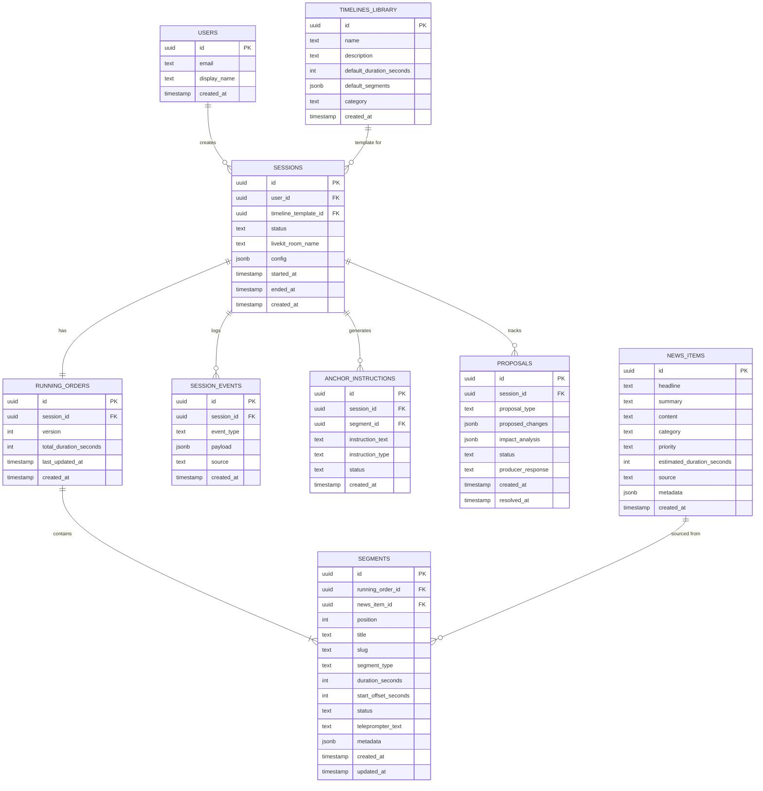

# 04 — Data Models

## Overview

All persistent data lives in **Supabase Postgres**. The hot working state during an active session is cached in **Redis (Upstash)**. This document defines both layers.

---

## Supabase (Postgres) Schema

### Entity Relationship Diagram



---

## Table Definitions

### `users`

Single user for MVP. Created during initial setup.

```sql
CREATE TABLE users (
    id UUID PRIMARY KEY DEFAULT gen_random_uuid(),
    email TEXT UNIQUE NOT NULL,
    display_name TEXT NOT NULL DEFAULT 'Producer',
    role TEXT NOT NULL DEFAULT 'producer',
    created_at TIMESTAMPTZ NOT NULL DEFAULT now(),
    updated_at TIMESTAMPTZ NOT NULL DEFAULT now()
);
```

### `timelines_library`

Pre-loaded timeline templates. These are the selectable options on the Dashboard.

```sql
CREATE TABLE timelines_library (
    id UUID PRIMARY KEY DEFAULT gen_random_uuid(),
    name TEXT NOT NULL,
    description TEXT,
    default_duration_seconds INTEGER NOT NULL,
    default_segments JSONB NOT NULL DEFAULT '[]',
    category TEXT NOT NULL DEFAULT 'general',
    is_active BOOLEAN NOT NULL DEFAULT true,
    created_at TIMESTAMPTZ NOT NULL DEFAULT now()
);
```

**`default_segments` JSONB structure:**

```json
[
    {
        "position": 1,
        "title": "Headlines",
        "slug": "headlines",
        "segment_type": "headlines",
        "duration_seconds": 120,
        "teleprompter_text": "Good evening, here are tonight's top stories..."
    },
    {
        "position": 2,
        "title": "Government Policy Update",
        "slug": "govt-policy",
        "segment_type": "package",
        "duration_seconds": 300,
        "teleprompter_text": "The government today announced..."
    }
]
```

### `sessions`

One session per active production run.

```sql
CREATE TABLE sessions (
    id UUID PRIMARY KEY DEFAULT gen_random_uuid(),
    user_id UUID NOT NULL REFERENCES users(id),
    timeline_template_id UUID REFERENCES timelines_library(id),
    status TEXT NOT NULL DEFAULT 'setup',
    -- Possible statuses: 'setup', 'active', 'paused', 'ended'
    livekit_room_name TEXT,
    config JSONB NOT NULL DEFAULT '{}',
    -- config stores: selected news categories, voice preferences, etc.
    started_at TIMESTAMPTZ,
    ended_at TIMESTAMPTZ,
    created_at TIMESTAMPTZ NOT NULL DEFAULT now(),
    updated_at TIMESTAMPTZ NOT NULL DEFAULT now(),

    CONSTRAINT valid_status CHECK (status IN ('setup', 'active', 'paused', 'ended'))
);

CREATE INDEX idx_sessions_user_id ON sessions(user_id);
CREATE INDEX idx_sessions_status ON sessions(status);
```

### `running_orders`

The versioned running order for a session. Each mutation creates a new version.

```sql
CREATE TABLE running_orders (
    id UUID PRIMARY KEY DEFAULT gen_random_uuid(),
    session_id UUID NOT NULL REFERENCES sessions(id) ON DELETE CASCADE,
    version INTEGER NOT NULL DEFAULT 1,
    total_duration_seconds INTEGER NOT NULL DEFAULT 0,
    last_updated_at TIMESTAMPTZ NOT NULL DEFAULT now(),
    created_at TIMESTAMPTZ NOT NULL DEFAULT now(),

    UNIQUE(session_id, version)
);

CREATE INDEX idx_running_orders_session ON running_orders(session_id);
```

> **Design Decision**: We version running orders rather than using soft-deletes on segments. This gives us full audit history and the ability to revert changes. For MVP, we keep only the latest version active and archive previous versions.

### `segments`

Individual segments within a running order.

```sql
CREATE TABLE segments (
    id UUID PRIMARY KEY DEFAULT gen_random_uuid(),
    running_order_id UUID NOT NULL REFERENCES running_orders(id) ON DELETE CASCADE,
    news_item_id UUID REFERENCES news_items(id),
    position INTEGER NOT NULL,
    title TEXT NOT NULL,
    slug TEXT NOT NULL,
    segment_type TEXT NOT NULL DEFAULT 'package',
    -- Types: 'headlines', 'package', 'live', 'break', 'weather', 'sports', 'interview', 'closing'
    duration_seconds INTEGER NOT NULL,
    start_offset_seconds INTEGER NOT NULL DEFAULT 0,
    -- Calculated: cumulative offset from show start
    status TEXT NOT NULL DEFAULT 'pending',
    -- Statuses: 'pending', 'on_air', 'completed', 'skipped'
    teleprompter_text TEXT NOT NULL DEFAULT '',
    metadata JSONB NOT NULL DEFAULT '{}',
    created_at TIMESTAMPTZ NOT NULL DEFAULT now(),
    updated_at TIMESTAMPTZ NOT NULL DEFAULT now(),

    CONSTRAINT valid_segment_type CHECK (
        segment_type IN ('headlines', 'package', 'live', 'break', 'weather', 'sports', 'interview', 'closing')
    ),
    CONSTRAINT valid_segment_status CHECK (
        status IN ('pending', 'on_air', 'completed', 'skipped')
    ),
    CONSTRAINT positive_duration CHECK (duration_seconds > 0),
    CONSTRAINT valid_position CHECK (position > 0)
);

CREATE INDEX idx_segments_running_order ON segments(running_order_id);
CREATE INDEX idx_segments_position ON segments(running_order_id, position);
```

**`start_offset_seconds` calculation:**

This field is computed, not stored directly by the user. When the running order is mutated, all segments after the mutation point have their `start_offset_seconds` recalculated:

```
segment[n].start_offset_seconds = segment[n-1].start_offset_seconds + segment[n-1].duration_seconds
```

### `news_items`

Pre-loaded news items for the MVP. These are the stories the agent can propose.

```sql
CREATE TABLE news_items (
    id UUID PRIMARY KEY DEFAULT gen_random_uuid(),
    headline TEXT NOT NULL,
    summary TEXT NOT NULL,
    content TEXT NOT NULL,
    -- Full teleprompter-ready text
    category TEXT NOT NULL DEFAULT 'general',
    priority TEXT NOT NULL DEFAULT 'medium',
    -- Priorities: 'critical', 'high', 'medium', 'low'
    estimated_duration_seconds INTEGER NOT NULL DEFAULT 180,
    source TEXT NOT NULL DEFAULT 'PTI',
    metadata JSONB NOT NULL DEFAULT '{}',
    -- metadata can include: location, related_stories, tags
    is_used BOOLEAN NOT NULL DEFAULT false,
    -- Tracks if this item has been added to the running order
    created_at TIMESTAMPTZ NOT NULL DEFAULT now(),

    CONSTRAINT valid_priority CHECK (
        priority IN ('critical', 'high', 'medium', 'low')
    )
);

CREATE INDEX idx_news_items_category ON news_items(category);
CREATE INDEX idx_news_items_priority ON news_items(priority);
```

### `proposals`

Tracks every AI proposal and its outcome. Critical for audit and safety.

```sql
CREATE TABLE proposals (
    id UUID PRIMARY KEY DEFAULT gen_random_uuid(),
    session_id UUID NOT NULL REFERENCES sessions(id) ON DELETE CASCADE,
    proposal_type TEXT NOT NULL,
    -- Types: 'insert', 'remove', 'reorder', 'modify_duration', 'replace'
    proposed_changes JSONB NOT NULL,
    impact_analysis JSONB NOT NULL,
    status TEXT NOT NULL DEFAULT 'pending',
    -- Statuses: 'pending', 'confirmed', 'rejected', 'modified', 'expired'
    producer_response TEXT,
    -- Natural language response from the producer
    created_at TIMESTAMPTZ NOT NULL DEFAULT now(),
    resolved_at TIMESTAMPTZ,

    CONSTRAINT valid_proposal_type CHECK (
        proposal_type IN ('insert', 'remove', 'reorder', 'modify_duration', 'replace')
    ),
    CONSTRAINT valid_proposal_status CHECK (
        status IN ('pending', 'confirmed', 'rejected', 'modified', 'expired')
    )
);

CREATE INDEX idx_proposals_session ON proposals(session_id);
CREATE INDEX idx_proposals_status ON proposals(status);
```

**`proposed_changes` JSONB structure (example: insert):**

```json
{
    "action": "insert",
    "segment": {
        "title": "Earthquake in Gujarat",
        "slug": "earthquake-gujarat",
        "segment_type": "live",
        "duration_seconds": 180,
        "teleprompter_text": "Breaking news coming in...",
        "news_item_id": "uuid-of-news-item"
    },
    "target_position": 3
}
```

**`impact_analysis` JSONB structure:**

```json
{
    "summary": "Inserting earthquake story at position 3 pushes 5 segments later",
    "affected_segments": [
        {
            "segment_id": "uuid",
            "title": "Sports Roundup",
            "old_position": 3,
            "new_position": 4,
            "old_start_offset": 600,
            "new_start_offset": 780,
            "delay_seconds": 180
        }
    ],
    "total_duration_change_seconds": 180,
    "new_total_duration_seconds": 1980,
    "overflow_seconds": 180,
    "suggestions": [
        "Shorten closing segment by 180 seconds",
        "Drop the lifestyle segment (position 7)"
    ]
}
```

### `anchor_instructions`

Generated instructions for the anchor.

```sql
CREATE TABLE anchor_instructions (
    id UUID PRIMARY KEY DEFAULT gen_random_uuid(),
    session_id UUID NOT NULL REFERENCES sessions(id) ON DELETE CASCADE,
    segment_id UUID REFERENCES segments(id),
    instruction_text TEXT NOT NULL,
    instruction_type TEXT NOT NULL DEFAULT 'transition',
    -- Types: 'transition', 'breaking', 'correction', 'timing', 'general'
    status TEXT NOT NULL DEFAULT 'pending',
    -- Statuses: 'pending', 'delivered', 'acknowledged'
    created_at TIMESTAMPTZ NOT NULL DEFAULT now(),

    CONSTRAINT valid_instruction_type CHECK (
        instruction_type IN ('transition', 'breaking', 'correction', 'timing', 'general')
    )
);

CREATE INDEX idx_anchor_instructions_session ON anchor_instructions(session_id);
```

### `session_events`

Append-only event log for every significant action in a session.

```sql
CREATE TABLE session_events (
    id UUID PRIMARY KEY DEFAULT gen_random_uuid(),
    session_id UUID NOT NULL REFERENCES sessions(id) ON DELETE CASCADE,
    event_type TEXT NOT NULL,
    payload JSONB NOT NULL DEFAULT '{}',
    source TEXT NOT NULL DEFAULT 'system',
    -- Sources: 'producer', 'agent', 'system', 'manual_ui'
    created_at TIMESTAMPTZ NOT NULL DEFAULT now()
);

CREATE INDEX idx_session_events_session ON session_events(session_id);
CREATE INDEX idx_session_events_type ON session_events(event_type);
CREATE INDEX idx_session_events_created ON session_events(created_at);
```

**Event types:**

| Event Type | Source | Payload |
|-----------|--------|---------|
| `session_started` | system | `{ timeline_template_id, config }` |
| `session_ended` | system | `{ duration_seconds, changes_count }` |
| `agent_joined` | agent | `{ room_name }` |
| `agent_left` | agent | `{ reason }` |
| `proposal_created` | agent | `{ proposal_id, proposal_type }` |
| `proposal_confirmed` | producer | `{ proposal_id }` |
| `proposal_rejected` | producer | `{ proposal_id, reason }` |
| `running_order_updated` | system | `{ version, changes }` |
| `manual_edit` | manual_ui | `{ change_type, details }` |
| `anchor_instruction_sent` | system | `{ instruction_id }` |
| `voice_error` | agent | `{ error_type, message }` |

---

## Redis (Upstash) Data Structures

### Active Running Order

**Key**: `session:{session_id}:running_order`  
**Type**: JSON (stored as string via `JSON.SET` or `SET`)  
**TTL**: Session duration + 1 hour

```json
{
    "session_id": "uuid",
    "version": 5,
    "total_duration_seconds": 1800,
    "segments": [
        {
            "id": "uuid",
            "position": 1,
            "title": "Headlines",
            "slug": "headlines",
            "segment_type": "headlines",
            "duration_seconds": 120,
            "start_offset_seconds": 0,
            "status": "completed",
            "teleprompter_text": "Good evening...",
            "news_item_id": null
        },
        {
            "id": "uuid",
            "position": 2,
            "title": "Government Policy",
            "slug": "govt-policy",
            "segment_type": "package",
            "duration_seconds": 300,
            "start_offset_seconds": 120,
            "status": "on_air",
            "teleprompter_text": "The government today...",
            "news_item_id": "uuid"
        }
    ],
    "updated_at": "2025-01-15T10:30:00Z"
}
```

### Pending Proposal

**Key**: `session:{session_id}:pending_proposal`  
**Type**: JSON string  
**TTL**: 5 minutes (auto-expire stale proposals)

```json
{
    "proposal_id": "uuid",
    "proposal_type": "insert",
    "proposed_changes": { "..." },
    "impact_analysis": { "..." },
    "created_at": "2025-01-15T10:30:00Z"
}
```

> **Critical invariant**: There can be at most ONE pending proposal at a time per session. A new proposal auto-expires the previous one.

### Agent Context

**Key**: `session:{session_id}:agent_context`  
**Type**: JSON string  
**TTL**: Session duration + 1 hour

```json
{
    "available_news_items": ["uuid1", "uuid2", "..."],
    "used_news_items": ["uuid3"],
    "conversation_summary": "Producer wants to focus on earthquake coverage...",
    "preferences": {
        "language": "hinglish",
        "verbosity": "concise"
    }
}
```

### Session Lock

**Key**: `session:{session_id}:lock`  
**Type**: String (lock holder ID)  
**TTL**: 30 seconds

Used to prevent concurrent mutations to the running order. The agent acquires this lock before applying any change.

```
SET session:{id}:lock "agent-{timestamp}" NX EX 30
```

---

## Data Consistency Rules

### Running Order Invariants

These must hold true after every mutation:

1. **Contiguous positions**: Segment positions must be 1, 2, 3, ..., N with no gaps
2. **Correct offsets**: `segment[n].start_offset = segment[n-1].start_offset + segment[n-1].duration`
3. **Total duration**: `total_duration = sum(segment.duration for all segments)`
4. **No duplicate positions**: Each position number appears exactly once
5. **Version monotonic**: Running order version always increases

### Write-Through Cache Pattern

```
Mutation Request
      │
      ├──▶ Acquire Redis lock
      │
      ├──▶ Read current state from Redis
      │
      ├──▶ Apply mutation + recalculate offsets
      │
      ├──▶ Validate invariants
      │
      ├──▶ Write to Redis (immediate)
      │
      ├──▶ Release Redis lock
      │
      ├──▶ Async: Persist to Supabase
      │         (new running_order version + segments)
      │
      └──▶ Supabase Realtime notifies frontend
```

### Cache Invalidation

- On **agent apply**: Redis is the leader. Write to Redis first, then persist to Supabase.
- On **manual UI edit**: Supabase is the leader. Write to Supabase, invalidate Redis, rebuild cache.
- On **cache miss**: Read from Supabase, populate Redis.
- On **session end**: Clear all Redis keys for the session.

---

## Seed Data (MVP)

The MVP requires pre-loaded data. Seed scripts should populate:

1. **1 user** (producer@sudriv.demo)
2. **4 timeline templates** (Morning Bulletin, Breaking News, Election Night, Evening Prime)
3. **20-30 news items** across categories (General, Politics, Sports, Weather, Business, Entertainment)
4. Each timeline template has 6-12 default segments with realistic teleprompter text

See [10-mvp-scope-and-demo-mode.md](./10-mvp-scope-and-demo-mode.md) for detailed seed data specifications.
